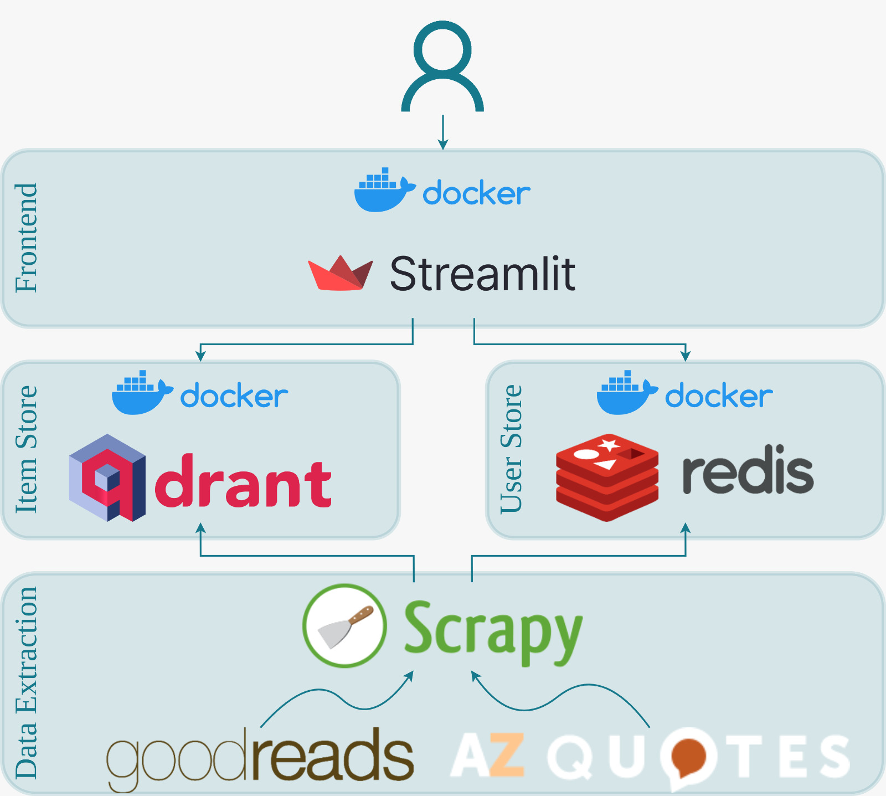

[](https://github.com/mathun3003/quotes-recommender/actions/workflows/code-style.yaml)

# SageSnippets - Quotes Recommender


## Table of Contents
- [Description](#description)
- [Installation](#installation)
- [Usage](#usage)
- [Architecture](#architecture)

## Description
## Installation
First, clone this repository to your machine.

If you want to develop/contribute to this project, use [poetry](https://python-poetry.org/) as a dependency manager.
Run from content root where the ```pyproject.toml``` is located:
```shell
poetry install
```
and you are free to go. Feel free to open a PR or open an issue.
## Usage
In case you want to make this project running, you can either use
```shell
docker compose up -d redis qdrant
```
in order to start the databases and subsequently type into the shell
```shell
streamlit run quotes_recommender/app.py
```

or just run 

```shell
docker compose up -d
```
However, make sure to run it from the correct working directory and the environment variables are correctly set in advance. 

Make sure to set the environment variables correctly. Therefore, you can use the [sample.local.env](sample.local.env) file.

The application will be available under ```http://0.0.0.0/sagesnippets```, whereas the database UIs are accessible via ``https://localhost:9999/dashboard`` (Qdrant) and ```https://localhost:8001``` (Redis).

## Architecture


- The ETL pipeline was implemented with Scrapy. Here, the spider for the goodreads website should be started first since we treat this data source on priority for data fusion ("Trust your Friends"). Then, the spider for AZ quotes could be started.
- The duplicate filtering as well as merging of item attributes is performed within the ETL process.
- Qdrant serves as a vector database for efficient searching for similar vector embeddings (based on SentenceBERT). Here, all the quotes are stored with their corresponding payloads and embeddings.
- Redis serves as a user store where the credentials for user login as well as the user preferences are stored.
- The web app is build with [Streamlit](https://streamlit.io/) and has four subpages:
  - ``Home`` where the user preferences of the logged-in user is displayed. Here, the individual preferences can be also changed (i.e., move to (dis-)likes, unselect)
  - ```Set Preferences``` where the logged-in user can set her preferences. Therefore, some initial quotes are displayed or the items can be filtered by keyword or tags.
  - ```Search for Quotes``` where the user can search based on a (short) query for semantically similar content among quotes. In addition, results can be filtered by tags.
  - ```Recommendations``` where similar items based on the set user preferences are displayed on the left side (item-item collaborative filtering) and the items of similar user(s) have liked are displayed on the right side (user-user collaborative filtering).

## Repository Structure

```
├── config
├── data
├── notebooks
├── quotes_recommender
│   ├── core
│   ├── ml_models
│   ├── quote_scraper
│   │   └── spiders
│   ├── ui
│   ├── user_store
│   ├── utils
│   └── vector_store
├── resources
└── tests
    ├── data
    └── vector_store
```

- ```config```:
  - configuration file for multi-page streamlit plugin
  - configuration file for Qdrant collections 
- ```data```: ignored folder for storing data files locally (e.g., output or log files, ML models from HuggingFace)
- ```notebooks```: ignored folder for storing jupyter notebooks locally.
- ```quotes_recommender```: Main directory containing the application's code base.
  - ``core``: Pydantic data models and constants that are shared among the entire project.
  - ``ml_models``: Containing classes/functions for ML models (e.g., SentenceBERT)
  - ``quote_scraper``: Pipeline, settings, middelwares, and items files for Scrapy spiders.
    - ```spiders```: directory containing the two spiders (i.e., for goodreads and AZ Quotes data sources).
  - ``ui``: Directory containing the streamlit (sub-)page specifications, one file per page.
  - ``user_store``: Directory containing Redis-related constants, models, and classes about the user store.
  - ```utils```: Utility files and functions (e.g., Config classes, Singleton class, etc.).
- ``vector_store``: Constants, models, and singleton files for the Qdrant vector store.
- ```resources```: image folder (e.g., logo or architecture overview)
- ```tests```: Some test cases (very limited due to time constraints)
